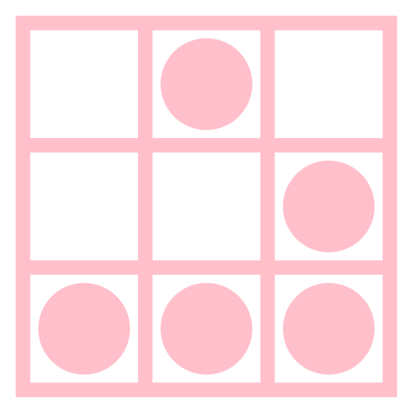

# Conway's Game of Life implemented in OPENRNDR

An implementation of Conway's Game of Life using OPENRNDR in Kotlin.

## Controls
- Draw on the canvas with a mouse to create new life
- Scroll up and down to control generation time
- Press space to pause / resume the simulation
- Press 'esc' to reset current pattern to the initial state
- Press 'r' to reset to a randomly chosen pattern
- Press 'c' to reset to a random canvas
- (TODO) Press 'g' to toggle grid visibility
- Press 's' to save the current state to a file
- (TODO) Press 'l' to load a state from a file
- Press 'i' to toggle info text (generation # and FPS)
- Press 'q' to quit the program
- (TODO) Press 'h' to show the help screen
- (TODO) Press 'f' to toggle fullscreen mode

## Settings
- Press period `.` or comma `,` to open the settings panel
- Select a new background color
- Choose a new pattern then press apply

## Gradle tasks

 - `./gradlew run` runs the TemplateProgram (Use `gradlew.bat run` under Windows)
 - `./gradlew shadowJar` creates an executable platform specific jar file with all dependencies. Run the resulting program by typing `java -jar build/libs/openrndr-template-1.0.0-all.jar` in a terminal from the project root.
 - `./gradlew jpackageZip` creates a zip with a stand-alone executable for the current platform (works with Java 14 only)

## Cross builds

To create a runnable jar for a platform different from your current platform, use `./gradlew jar -PtargetPlatform=<platform>`, where `<platform>` is either `windows`, `macos`, `linux-x64`, or `linux-arm64`. 

