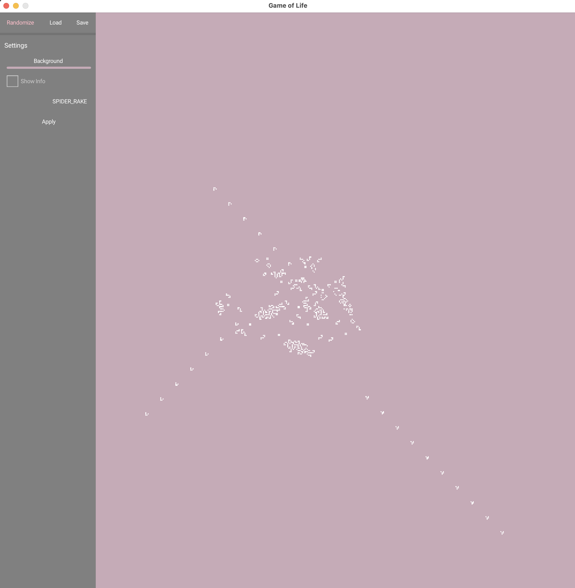

# Conway's Game of Life in Kotlin / OPENRNDR

An implementation of [Conway's Game of Life](https://en.wikipedia.org/wiki/Conway%27s_Game_of_Life) using [OPENRNDR](https://openrndr.org/) in Kotlin.

Inspired by [Golly](https://golly.sourceforge.io/) and the [Edwin Jakobs KotlinConf talk](https://www.youtube.com/watch?v=GysSoSwmLYo).

## Get Started

Download the latest [release](https://github.com/hbmartin/openrndr-game-of-life/releases) for your platform and use the [controls](#controls) to interact.

## Controls
- Click and drag on the canvas to create new life
- Scroll up and down to control generation time
- `space` to pause / resume the simulation
- `esc` to reset current pattern to the initial state
- `r` to reset to a randomly chosen pattern
- `c` to reset to a randomized canvas
- `s` to save the current state to an RLE / Golly file
- `l` to load a state from an RLE / Golly file
- `i` to toggle info text (generation # and FPS)
- (TODO) Press 'g' to toggle grid visibility
- (TODO) Press 'f' to toggle fullscreen mode
- `q` to quit the program

## Settings
- Press period `.` or comma `,` to open the settings panel
- Select a new background color
- Choose a new pattern

## Gradle tasks

 - `./gradlew run` runs the TemplateProgram (Use `gradlew.bat run` under Windows)
 - `./gradlew shadowJar` creates an executable platform specific jar file with all dependencies. Run the resulting program by typing `java -jar build/libs/<name-version>.jar` in a terminal from the project root.
 - `./gradlew jpackageZip` creates a zip with a stand-alone executable for the current platform (works with Java 14 only)

## Cross builds

To create a runnable jar for a platform different from your current platform, use `./gradlew jar -PtargetPlatform=<platform>`, where `<platform>` is either `windows`, `macos`, `linux-x64`, or `linux-arm64`. 

## See also

- [Another Openrndr GoL that I found too late](https://github.com/ikolomiets/openrndr-game-of-life)